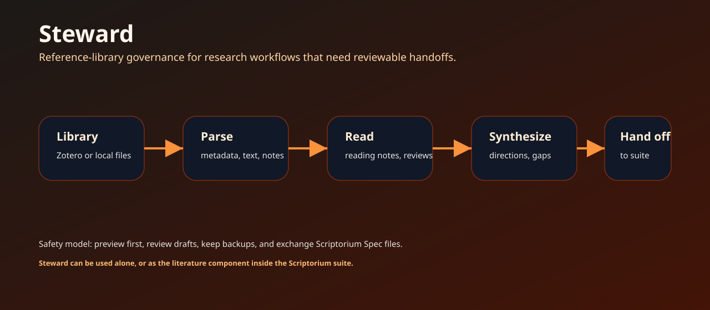

# Steward

[](https://github.com/scriptorium-suite/steward/actions/workflows/ci.yml)
[](https://github.com/scriptorium-suite/steward/releases)
[](LICENSE)

Steward 是 Scriptorium 套件中的文献和资料治理组件。它把本地或 Zotero 支持的文献库整理成可审查的阅读笔记、结构化 proposal、引用脉络和下游 handoff 文件。



## 它适合做什么

很多研究工作并不是从清晰题目开始，而是从一个模糊想法和一堆论文开始。Steward 负责这段流程：选择来源、解析文献、形成阅读笔记、比较材料、整理证据，并把结果交给后续工具或 Agent 继续推进。

Steward 可以独立作为文献库治理工具使用。在 Scriptorium 套件里，它是文献和来源准备组件。

## 核心能力

| 能力 | 说明 |
| --- | --- |
| 备份与审计 | 在改动文献库前先检查和保护数据。 |
| 选择与 proposal | 选择候选来源，并生成结构化 proposal。 |
| 解析 | 将论文转换为结构化记录，支持本地解析流程。 |
| 引用脉络 | 基于解析材料构建库内引用图。 |
| 阅读笔记 | 把 reading-note 契约渲染成可浏览笔记。 |
| Review | 生成明确区分 claim、限制和证据的 review 文件。 |
| Handoff | 导出兼容 Scriptorium Spec 的文件，供下游工具继续使用。 |

## 快速开始

```powershell
git clone https://github.com/scriptorium-suite/steward.git
cd steward
py -m venv .venv
.\.venv\Scripts\python.exe -m pip install -e .
.\.venv\Scripts\steward.exe --help
```

执行任何文献库操作前，先做安全审计：

```powershell
.\.venv\Scripts\steward.exe audit --help
```

处理 proposal 和 handoff：

```powershell
.\.venv\Scripts\steward.exe pick --help
.\.venv\Scripts\steward.exe proposal --help
.\.venv\Scripts\steward.exe export --help
```

## 文献工作流

```text
Zotero 或本地来源列表
        │
        ▼
backup + audit
        │
        ▼
pick sources → parse papers → produce reading notes
        │
        ▼
lineage graph + review files
        │
        ▼
proposal / handoff 文件交给 Scriptorium、Provenance 或其他工具
```

这个流程强调先审查再交付。Steward 应该帮助研究者或项目负责人看清楚发生了什么变化，以及为什么这些材料可以被下游工具使用。

## 可选本地解析

部分解析流程会使用 GROBID 或其他本地服务。这些服务是可选的，由用户在自己的环境中运行。Steward 的公开契约是结构化输出文件，而不是一个托管解析服务。

## 与套件协同

Steward 写出 [scriptorium-spec](https://github.com/scriptorium-suite/scriptorium-spec) 契约文件，因此可以被以下组件消费：

- [Scriptorium](https://github.com/scriptorium-suite/scriptorium)：作为项目资料入口。
- [Provenance](https://github.com/foxsplendid/Provenance)：作为本地项目记忆来源。
- 幻灯片或报告组件：作为下游 handoff 材料。

## 安全契约

Steward 围绕 preview、backup 和 review 设计，不应该静默修改用户文献库。请显式选择来源，检查生成草稿，并确保原始文献库数据可恢复。

公开 fixture 使用合成或无害样例。不要把私有论文、私人笔记、Zotero 凭据或个人研究材料提交到公开仓库。

## 开发

```powershell
.\.venv\Scripts\python.exe -m pytest
```

## 许可证

Apache-2.0。见 [LICENSE](LICENSE)。
